# Diagram Autentykacji - 10x-cards

## Pełny cykl życia autentykacji w aplikacji

```mermaid
sequenceDiagram
    autonumber
    participant Przeglądarka
    participant Middleware
    participant AstroAPI
    participant SupabaseAuth

    Note over Przeglądarka,SupabaseAuth: REJESTRACJA UŻYTKOWNIKA

    Przeglądarka->>Przeglądarka: Użytkownik wypełnia formularz
    Przeglądarka->>Przeglądarka: Walidacja email i hasła
    Przeglądarka->>AstroAPI: POST /api/auth/register
    activate AstroAPI
    AstroAPI->>SupabaseAuth: signUp(email, password)
    activate SupabaseAuth

    alt Email już istnieje
        SupabaseAuth-->>AstroAPI: Błąd: Email zajęty
        AstroAPI-->>Przeglądarka: 400 Bad Request
        Przeglądarka->>Przeglądarka: Wyświetl komunikat błędu
    else Rejestracja udana
        SupabaseAuth->>SupabaseAuth: Utworzenie konta użytkownika
        SupabaseAuth-->>AstroAPI: Sukces + dane użytkownika
        AstroAPI-->>Przeglądarka: 201 Created
        Przeglądarka->>Przeglądarka: Przekierowanie do /login
    end

    deactivate SupabaseAuth
    deactivate AstroAPI

    Note over Przeglądarka,SupabaseAuth: LOGOWANIE UŻYTKOWNIKA

    Przeglądarka->>Przeglądarka: Użytkownik wprowadza dane
    Przeglądarka->>AstroAPI: POST /api/auth/login
    activate AstroAPI
    AstroAPI->>SupabaseAuth: signInWithPassword(email, password)
    activate SupabaseAuth

    alt Nieprawidłowe dane
        SupabaseAuth-->>AstroAPI: Błąd: Nieprawidłowe dane
        AstroAPI-->>Przeglądarka: 401 Unauthorized
        Przeglądarka->>Przeglądarka: Wyświetl komunikat błędu
    else Logowanie udane
        SupabaseAuth->>SupabaseAuth: Weryfikacja credentials
        SupabaseAuth-->>AstroAPI: access_token + refresh_token
        AstroAPI->>AstroAPI: Ustawienie httpOnly cookies
        Note over AstroAPI: Cookies: access_token, refresh_token
        AstroAPI-->>Przeglądarka: 200 OK + Set-Cookie headers
        Przeglądarka->>Przeglądarka: Przekierowanie do /
    end

    deactivate SupabaseAuth
    deactivate AstroAPI

    Note over Przeglądarka,SupabaseAuth: DOSTĘP DO CHRONIONEJ STRONY

    Przeglądarka->>Middleware: GET / (z cookies)
    activate Middleware
    Middleware->>Middleware: Odczyt access_token z cookies
    Middleware->>SupabaseAuth: Weryfikacja access_token
    activate SupabaseAuth

    alt Token ważny
        SupabaseAuth-->>Middleware: Token poprawny + dane użytkownika
        Middleware->>Middleware: Dodanie user do context
        Middleware-->>Przeglądarka: Renderowanie strony
    else Token wygasł
        SupabaseAuth-->>Middleware: Token wygasł
        Middleware->>Middleware: Odczyt refresh_token z cookies
        Middleware->>SupabaseAuth: refreshSession(refresh_token)

        alt Refresh token ważny
            SupabaseAuth->>SupabaseAuth: Generowanie nowego access_token
            SupabaseAuth-->>Middleware: Nowy access_token + refresh_token
            Middleware->>Middleware: Aktualizacja cookies
            Middleware->>Middleware: Dodanie user do context
            Middleware-->>Przeglądarka: Renderowanie + Set-Cookie
        else Refresh token nieważny
            SupabaseAuth-->>Middleware: Błąd: Sesja wygasła
            Middleware->>Middleware: Usunięcie cookies
            Middleware-->>Przeglądarka: Przekierowanie do /login
        end
    else Brak tokenu
        SupabaseAuth-->>Middleware: Brak autoryzacji
        Middleware-->>Przeglądarka: Przekierowanie do /login
    end

    deactivate SupabaseAuth
    deactivate Middleware

    Note over Przeglądarka,SupabaseAuth: ODŚWIEŻENIE STRONY

    Przeglądarka->>Middleware: GET / (z cookies)
    activate Middleware
    Middleware->>Middleware: Odczyt access_token z cookies
    Middleware->>SupabaseAuth: Weryfikacja access_token
    activate SupabaseAuth
    SupabaseAuth-->>Middleware: Token poprawny + dane użytkownika
    deactivate SupabaseAuth
    Middleware->>Middleware: Sesja utrzymana
    Middleware-->>Przeglądarka: Renderowanie strony
    deactivate Middleware
    Note over Przeglądarka: Użytkownik pozostaje zalogowany

    Note over Przeglądarka,SupabaseAuth: WYLOGOWANIE UŻYTKOWNIKA

    Przeglądarka->>AstroAPI: POST /api/auth/logout
    activate AstroAPI
    AstroAPI->>SupabaseAuth: signOut()
    activate SupabaseAuth
    SupabaseAuth->>SupabaseAuth: Unieważnienie sesji
    SupabaseAuth-->>AstroAPI: Sukces
    deactivate SupabaseAuth
    AstroAPI->>AstroAPI: Usunięcie cookies
    AstroAPI-->>Przeglądarka: 200 OK + Clear cookies
    deactivate AstroAPI
    Przeglądarka->>Przeglądarka: Przekierowanie do /login

    Note over Przeglądarka,SupabaseAuth: USUWANIE KONTA

    Przeglądarka->>Przeglądarka: Użytkownik potwierdza usunięcie
    Przeglądarka->>AstroAPI: DELETE /api/auth/account
    activate AstroAPI
    AstroAPI->>AstroAPI: Weryfikacja access_token

    alt Użytkownik uwierzytelniony
        AstroAPI->>SupabaseAuth: deleteUser(userId)
        activate SupabaseAuth

        par Usuwanie danych użytkownika
            SupabaseAuth->>SupabaseAuth: Usunięcie konta
        and Usuwanie powiązanych danych
            AstroAPI->>AstroAPI: Usunięcie wszystkich fiszek
        end

        SupabaseAuth-->>AstroAPI: Konto usunięte
        deactivate SupabaseAuth
        AstroAPI->>AstroAPI: Usunięcie cookies
        AstroAPI-->>Przeglądarka: 200 OK
        Przeglądarka->>Przeglądarka: Przekierowanie do /login
    else Brak autoryzacji
        AstroAPI-->>Przeglądarka: 401 Unauthorized
    end

    deactivate AstroAPI

    Note over Przeglądarka,SupabaseAuth: PRÓBA DOSTĘPU DO /LOGIN PRZEZ ZALOGOWANEGO

    Przeglądarka->>Middleware: GET /login (z cookies)
    activate Middleware
    Middleware->>Middleware: Odczyt access_token z cookies
    Middleware->>SupabaseAuth: Weryfikacja access_token
    activate SupabaseAuth
    SupabaseAuth-->>Middleware: Token poprawny + dane użytkownika
    deactivate SupabaseAuth
    Middleware->>Middleware: Użytkownik już zalogowany
    Middleware-->>Przeglądarka: Przekierowanie do /
    deactivate Middleware
```

<mermaid_diagram>

</mermaid_diagram>

## Opis kluczowych elementów architektury autentykacji

### Aktorzy systemu

1. **Przeglądarka**: Interfejs użytkownika, przechowuje tokeny w httpOnly cookies
2. **Middleware**: Warstwa weryfikacji przed renderowaniem stron Astro
3. **Astro API**: Endpointy obsługujące operacje autentykacji
4. **Supabase Auth**: Zewnętrzny serwis zarządzający autentykacją

### Mechanizmy bezpieczeństwa

- **httpOnly cookies**: Tokeny niedostępne dla JavaScript, ochrona przed XSS
- **Automatyczne odświeżanie tokenów**: Seamless UX bez wylogowywania
- **Weryfikacja na poziomie middleware**: Ochrona przed nieautoryzowanym dostępem
- **Walidacja po stronie serwera**: Wszystkie operacje weryfikowane przez Supabase

### Przepływ tokenów

1. **Logowanie**: Supabase → API → Cookies w przeglądarce
2. **Każde żądanie**: Cookies automatycznie wysyłane do serwera
3. **Weryfikacja**: Middleware sprawdza ważność przed renderowaniem
4. **Odświeżanie**: Automatyczne przy wygaśnięciu access_token
5. **Wylogowanie**: Usunięcie cookies i unieważnienie sesji

### Obsługa wygaśnięcia sesji

- **Access token wygasł**: Automatyczne odświeżenie przez middleware
- **Refresh token wygasł**: Przekierowanie do /login
- **Brak tokenów**: Przekierowanie do /login dla chronionych stron
